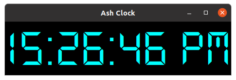

# Desktop Clock

**This is a Desktop clock app**

    This App is Fully Written in The Python Programming Language in Under 20 lines of codes.

    The Font used is the DS - Digital, you can downlaod it here:

**[Ds-digital](https://www.dafont.com/ds-digital.font "DS - Digital")**

Also you can run the script by using command: 

~~~Terminal
    python3 main.py
~~~